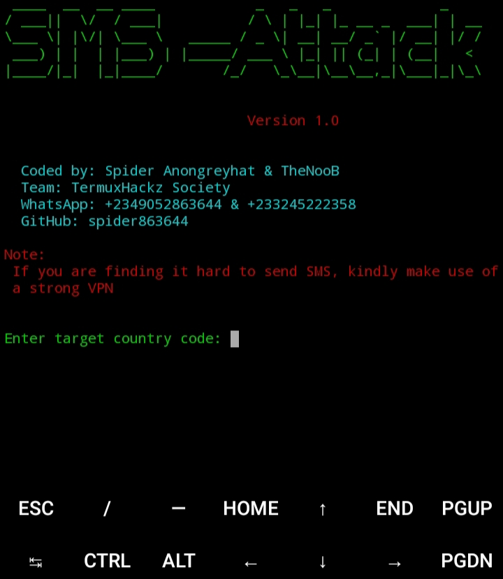

# SMS-Attack
A social engineering toolkit for performing smishing, and other sms attacks. <br>
It was created by TheNooB and Spider Anongreyhat<br>

## Note:
You can only send 1 sms daily

## Screenshot


## How to Install on termux
```
apt update && apt upgrade

apt install python3

apt install git

apt install pip

git clone https://github.com/spider864644/SMS-Attack

pip install -r requirements.txt

python3 sms.py

```

## How to install on Linux

```

sudo apt update && apt upgrade<br><br>

sudo apt install python3

sudo apt install git

sudo apt install pip

git clone https://github.com/spider864644/SMS-Attack

sudo pip install -r requirements.txt

python3 sms.py

```

### Important Note

If you are finding it difficult to send sms, just connect to a strong VPN and switch it to "USA"

### Credit goes to:
<b>TheNooB<br>
Spider Anongreyhat</b>

## Support this project by:
<b>
Following me on github<br>
Giving the project a star<br>
Folk this project<br>
Sharing this project<br>
Report any bugs you found

</b> 
